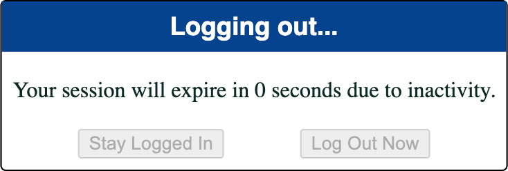

# Idle Hands

Use Idle Hands to automatically log your users out after a period of inactivity
across one or more browser windows or tabs.




## Basic Usage

```html
<script type="module">
    import IdleHands from './idle-hands/IdleHands.js';

    new IdleHands({logoutUrl: 'https://abc.xyz/logout/'});
</script>
```

### Advanced Usage

```html
<script type="module">
    import IdleHands from './idle-hands/IdleHands.js';

    new IdleHands({
        logoutUrl: 'https://abc.xyz/logout/',
        maximumIdleDuration: 60 * 1000 * 15, // 15 minutes
        debug: true,
    });
</script>
```

## Settings

| Name                  | Default Value                                                    | Description                                                                                                                          |
|-----------------------|------------------------------------------------------------------|--------------------------------------------------------------------------------------------------------------------------------------|
| `applicationId`       | `window.location.hostname`                                       | Used to prevent conflicts with other site using Idle Hands (should be unique)                                                        |
| `cancelButtonText`    | `'Stay Logged In'`                                               | The text to display on the button which hides the prompt and resets the timer                                                        |
| `containerSelector`   | `'body'`                                                         | A selector for the element which the Idle Hands prompt should be attached to                                                         |
| `containerTitle`      | `'Session Expiration Warning Prompt'`                            | A descriptive title to apply to the `iframe` containing the prompt (used for accessibility)                                          |
| `debug`               | `false`                                                          | Controls whether debug messages are logged                                                                                           |
| `dialogTextAllowHtml` | `false`                                                          | Controls whether HTML in `promptDialogText` is rendered                                                                              |
| `dialogText`          | `'Your session will expire in %time seconds due to inactivity.'` | The text to display in the body of the prompt dialog box (`%time` is automatically replaced with the remaining seconds until logout) |
| `documentTitle`       | `'Session Expiration Warning'`                                   | The HTML document title to use while the prompt is displayed                                                                         |
| `duration`            | `30 * 1000`                                                      | Defines how long before logout to display the prompt                                                                                 |
| `events`              | `['click', 'keypress', 'scroll', 'wheel', 'mousewheel']`         | An array of events which should reset the inactivity timer                                                                           |
| `headerText`          | `'Session Expiration Warning'`                                   | The text to display in the header of the prompt dialog                                                                               |
| `heartbeatInterval`   | `60 * 1000`                                                      | Defines how often a request should be sent to `heartbeatUrl`                                                                         |
| `heartbeatUrl`        | `window.location.href`                                           | A URL which can be used to keep a user's session alive                                                                               |
| `logoutButtonText`    | `'Log Out Now'`                                                  | The text to display on the button which initiates logout                                                                             |
| `logoutDocumentTitle` | `'Logging out...'`                                               | The HTML document title to use while redirecting for logout                                                                          |
| `logoutText`          | `'Logging out...'`                                               | The text to display in the header of the prompt dialog box while logging out                                                         |
| `logoutUrl`           | *(none)*                                                         | The URL to redirect to when logging out (required)                                                                                   |
| `manualLogoutUrl`     | Value of `logoutUrl`                                             | The URL to redirect to when the logout button is clicked                                                                             |
| `maximumIdleDuration` | `60 * 1000 * 60`                                                 | The maximum amount of time which a user is allowed to be inactivty before being logged out by Idle Hands                             |
| `shiftFocus`          | `true`                                                           | Controls whether focus should shift to the promopt dialog cancel button when the prompt is displayed                                 |
| `zindex`              | `9999`                                                           | The `z-index` of the prompt element                                                                                                  |
